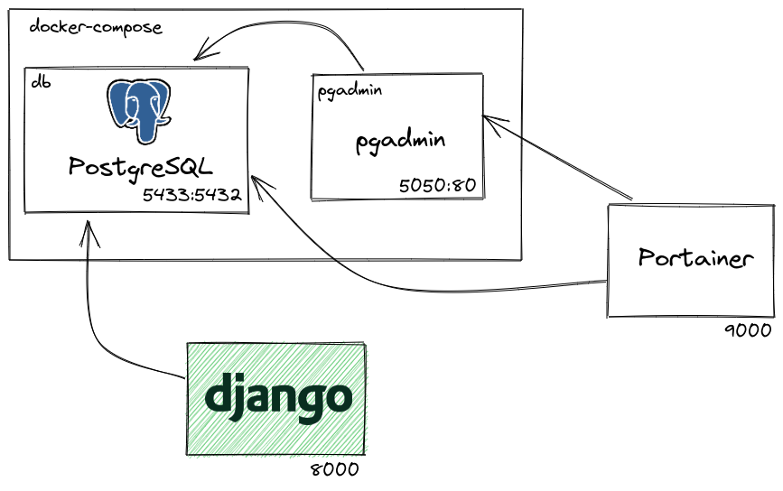

# recipe-app-api-drf-course-udemy

Curso de DRF with TDD - Build a Backend REST API with Python &amp; Django - Advanced

## Este projeto foi feito com:

* [Python 3.10.6 (on Docker)](https://www.python.org/)
* [Django 4.1](https://www.djangoproject.com/)
* [Django Rest Framework 3.13.1](https://www.django-rest-framework.org/)

## Como rodar o projeto?

* Clone esse repositório.
* Crie um virtualenv com Python 3.
* Ative o virtualenv.
* Instale as dependências.
* Rode as migrações.

O projeto Django roda locamente. No Docker temos apenas o PostgreSQL e o pgAdmin.

```
git clone https://github.com/rg3915/recipe-app-api-drf-course-udemy.git
cd recipe-app-api-drf-course-udemy
python -m venv .venv
source .venv/bin/activate
pip install -r requirements.txt
python contrib/env_gen.py

docker-compose up -d

python manage.py migrate
python manage.py createsuperuser --username="admin" --email=""
```



## Links

https://github.com/LondonAppDeveloper/c2-recipe-app-api-2
